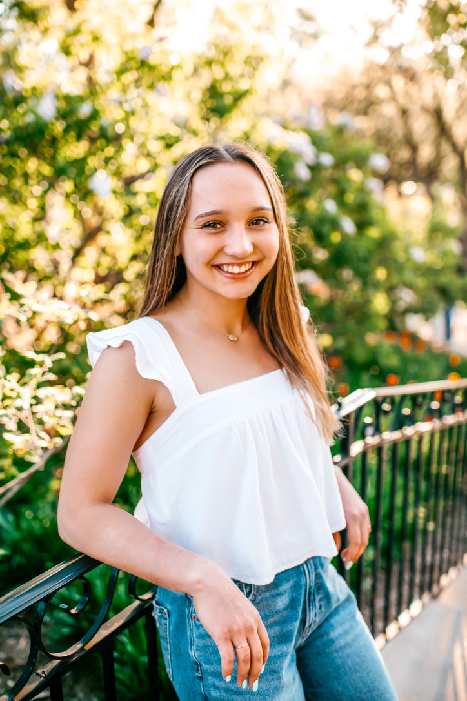

# Wicked Problems
### Introduction
Hello, My name is Sarah and I'm a Freshman at William & Mary. I'm on the Women's Gymnastics Team and I plan on majoring in International Relations. In my free time, I like to paint custom shoes, go to coffee shops, and hang out with my friends. I'm also the oldest of six kids and my youngest siblings are 9 year old triplets. In this class, I hope to learn basic coding skills that I can use in future classes and research.

 

#### Informal responses:
<img src=
#### Projects:
